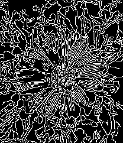
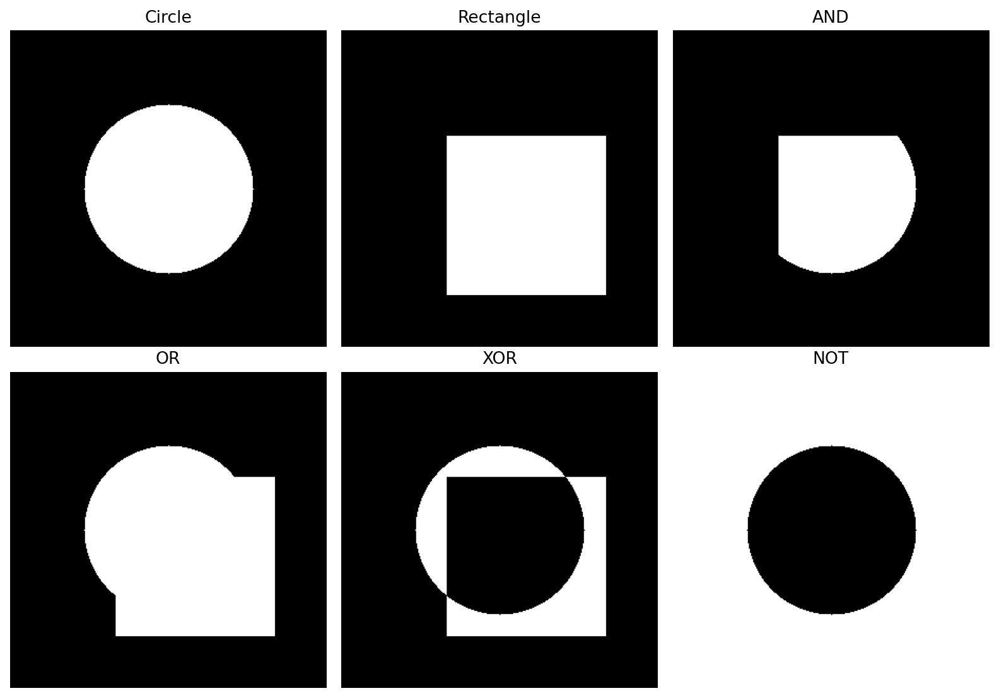

# Edge Detection And Bitwise Operations In OpenCV

This folder contains my practical learning work for edge detection and binary image operations using OpenCV. The goal was to understand how OpenCV can extract important boundaries from an image and how logical operations can be applied on binary images or masks.

## Folder Contents

| File | Purpose |
| --- | --- |
| `canny_func.py` | Applies Canny edge detection on an input flower image. |
| `bitwise_op.py` | Demonstrates bitwise AND, OR, XOR, and NOT operations using simple binary shapes. |
| `flower.jpeg` | Input image used for Canny edge detection. |
| `canny_edges_output.png` | Generated output from `canny_func.py`. |
| `bitwise_operations_output.png` | Generated visual output from `bitwise_op.py`. |
| `aloeL.jpg` | Additional image asset available in this folder. |

## 1. Canny Edge Detection

Canny edge detection is used to find important boundaries in an image. It works well because it reduces noise, finds strong gradients, removes weak non-edge pixels, and connects meaningful edge lines.

### Input Image


### Code Concept

```python
image = cv2.imread(str(image_path), cv2.IMREAD_GRAYSCALE)
edges = cv2.Canny(image, 50, 150)
```

### What I Learned

- Images can be loaded directly in grayscale using `cv2.IMREAD_GRAYSCALE`.
- Edge detection works on intensity changes, so grayscale is enough for this task.
- `cv2.Canny()` uses two threshold values:
  - `50`: lower threshold.
  - `150`: upper threshold.
- Pixels with strong intensity changes become white edges.
- Non-edge regions remain black.

### Output Image



## 2. Bitwise Operations

Bitwise operations are useful when working with binary images, masks, segmentation, and object isolation. In this script, I created two black images using NumPy, drew a white circle on one image, drew a white rectangle on another image, and applied logical operations between them.

### Operations Practiced

| Operation | Meaning |
| --- | --- |
| `cv2.bitwise_and()` | Keeps only the common white area between two images. |
| `cv2.bitwise_or()` | Keeps all white areas from both images. |
| `cv2.bitwise_xor()` | Keeps areas that are white in only one image, not both. |
| `cv2.bitwise_not()` | Inverts black and white pixels. |

### Code Concept

```python
img1 = np.zeros((300, 300), dtype=np.uint8)
img2 = np.zeros((300, 300), dtype=np.uint8)

cv2.circle(img1, (150, 150), 80, 255, -1)
cv2.rectangle(img2, (100, 100), (250, 250), 255, -1)

bitwise_and = cv2.bitwise_and(img1, img2)
bitwise_or = cv2.bitwise_or(img1, img2)
bitwise_xor = cv2.bitwise_xor(img1, img2)
bitwise_not = cv2.bitwise_not(img1)
```

### Output Image



## How To Run

From the project root:

```bash
python3 "Edge Detection in Open CV/canny_func.py"
python3 "Edge Detection in Open CV/bitwise_op.py"
```

Both scripts open visual windows. Press any key for the Canny script window, and close the Matplotlib window for the bitwise script.

## Generated Output Files

The saved output images in this folder are:

```text
Edge Detection in Open CV/canny_edges_output.png
Edge Detection in Open CV/bitwise_operations_output.png
```

## Summary

This section helped me understand two important image processing ideas:

- Edge detection extracts meaningful boundaries from a real image.
- Bitwise operations combine or modify binary image regions, which is useful when creating masks and isolating objects.

These concepts are important building blocks for segmentation, object detection, contour detection, and more advanced computer vision workflows.
