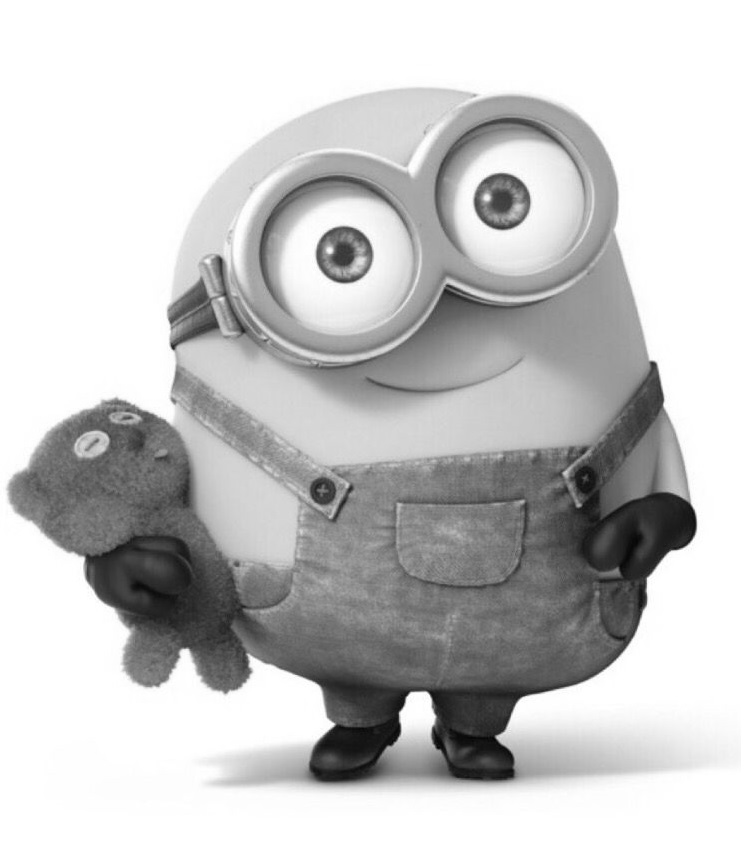
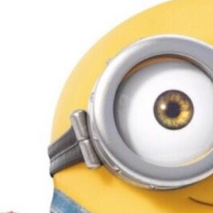
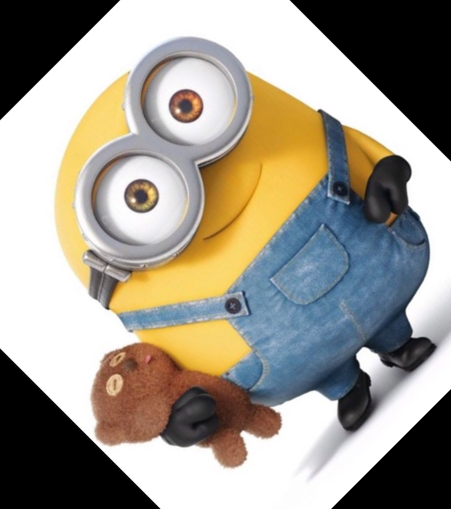
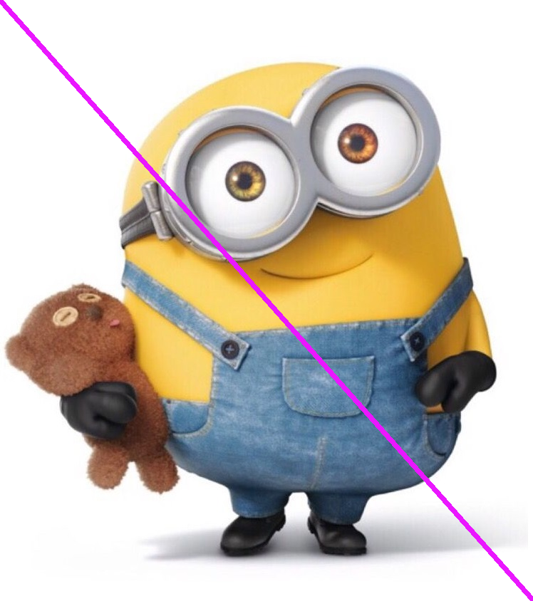
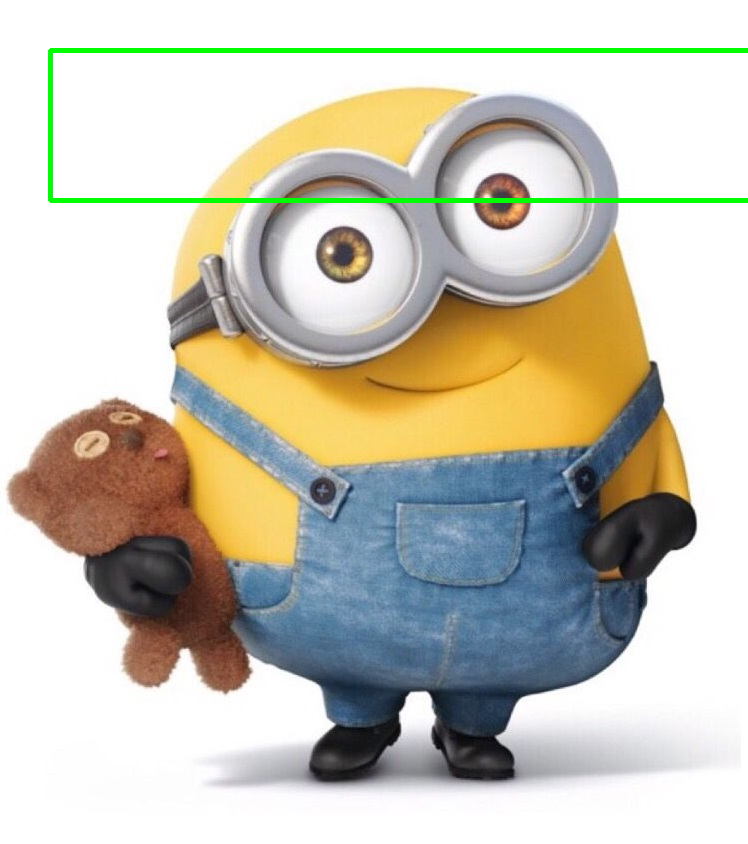
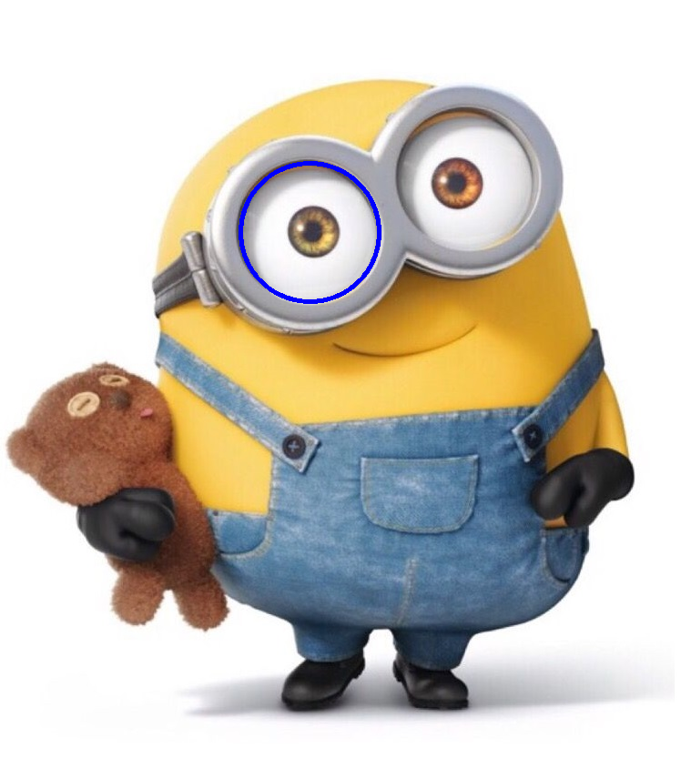
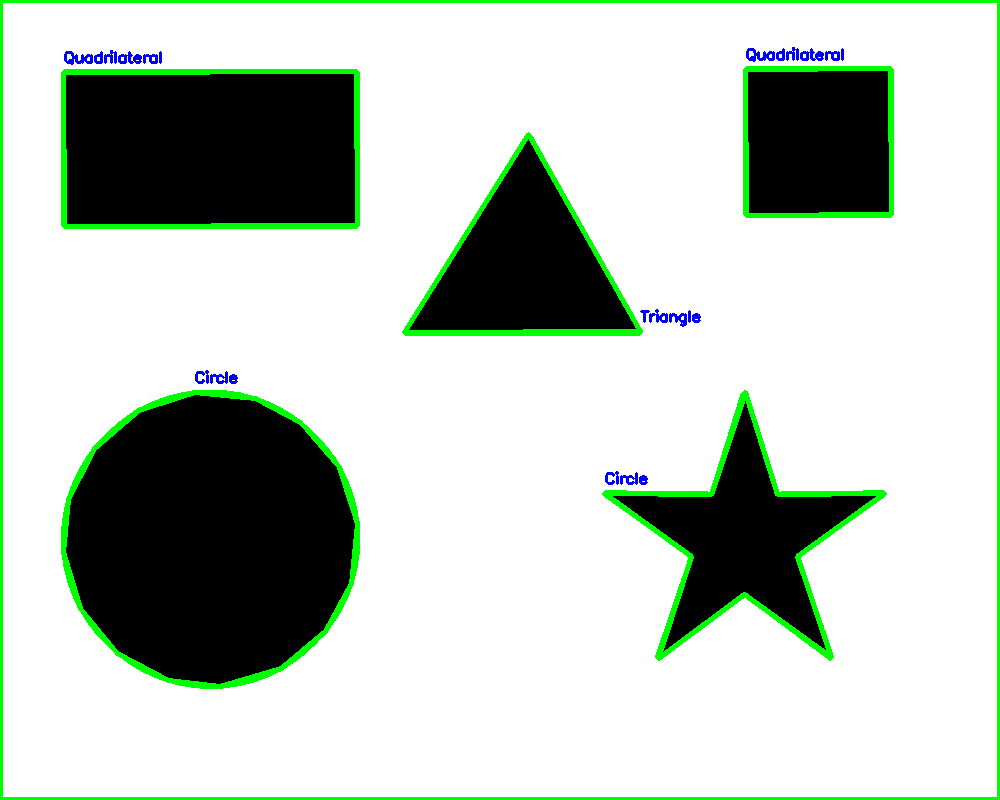
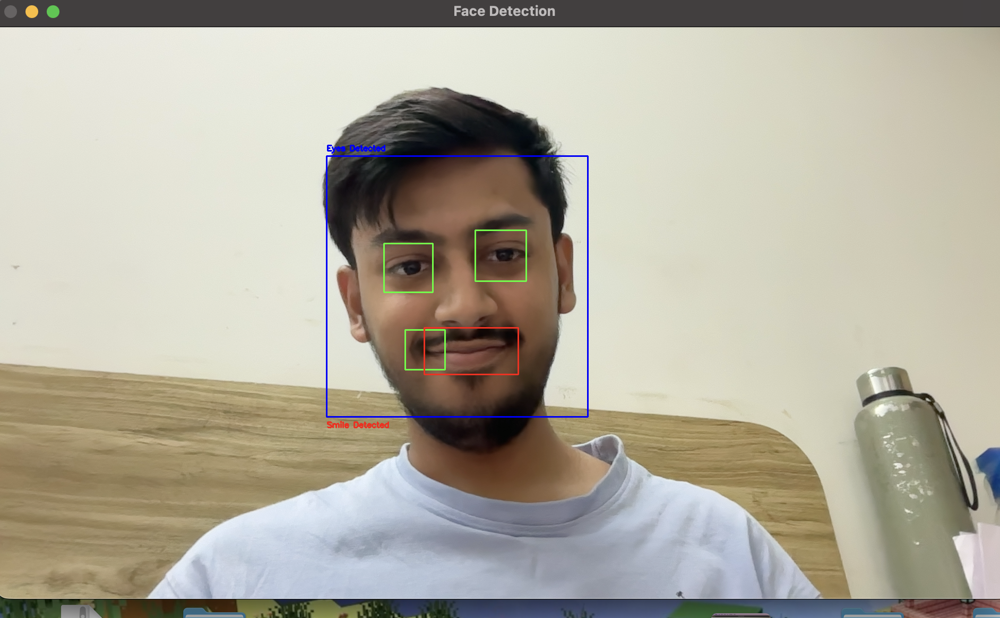

# OpenCV Learning Repository

## Overview

This repository contains a collection of OpenCV scripts and mini-projects that demonstrate fundamental and advanced computer vision concepts using Python. The project takes a hands-on approach to learning, progressing from basic image handling and transformations to real-time face, eye, and smile detection.

## Table of Contents

- [Environment and Dependencies](#environment-and-dependencies)
- [Repository Structure](#repository-structure)
- [Features and Implementations](#features-and-implementations)
- [Visual Results](#visual-results)

## Environment and Dependencies

This project is built using Python (>=3.13) and relies on the following libraries:

- opencv-python (>=4.13.0)
- matplotlib (>=3.10.9)
- numpy

To install the dependencies, you can use pip:

```bash
pip install opencv-python matplotlib numpy
```

Alternatively, if you are using a virtual environment with the provided `pyproject.toml`:

```bash
pip install .
```

## Repository Structure

The codebase is organized by topic to allow independent study of each OpenCV concept.

- **Image Handeling Basics**: Reading, displaying, converting to grayscale, and saving images.
- **Image Resizing & Shape**: Scaling, cropping, flipping, and applying affine transformations (rotation).
- **Image Drawing Functions**: Annotating images with lines, rectangles, circles, and text.
- **Filtering & Blurring**: Applying Gaussian blur, median blur, and custom sharpening kernels.
- **Edge Detection in Open CV**: Feature extraction using the Canny edge detector and bitwise operations.
- **Contor & Shape Detection**: Finding and drawing contours, shape approximation, and perimeter calculations.
- **Video Functions**: Capturing live webcam streams, processing frames, and saving to disk.
- **Face Detection in OpenCV**: Real-time object detection using Haar cascades for faces, eyes, and smiles.

## Features and Implementations

1. **Basic Operations**: Load images as NumPy arrays, inspect channels, and convert BGR to Grayscale.
2. **Transformations**: Modify image structure using resizing, slicing for cropping, and transformation matrices for rotation.
3. **Drawing**: Dynamically draw shapes and text to highlight areas of interest (useful for object detection bounding boxes).
4. **Filtering**: Reduce noise using blurs or enhance details using sharpening kernels.
5. **Edge & Contour Analysis**: Convert to binary images, extract edges, and classify geometric shapes (e.g., triangles, rectangles, circles) based on vertex approximation.
6. **Real-Time Video Processing**: Apply frame-by-frame analysis on live camera feeds.
7. **Haar Cascade Detection**: Identify specific facial features efficiently using region-of-interest (ROI) processing.

## Visual Results

Below are comparisons of the original input images and the processed output images generated by the scripts.

### 1. Image Transformations

**Input Image:**


**Outputs:**
- **Grayscale:**
  

- **Resized:**
  

- **Cropped:**
  

- **Rotated:**
  

### 2. Drawing Functions

**Outputs:**
- **Line Drawn:**
  

- **Rectangle Drawn:**
  

- **Circle Drawn:**
  

### 3. Contour and Shape Detection

**Input Shapes:**


**Output Contours Detected:**


### 4. Face Detection

**Output Face Detection (Webcam / Real-Time):**

